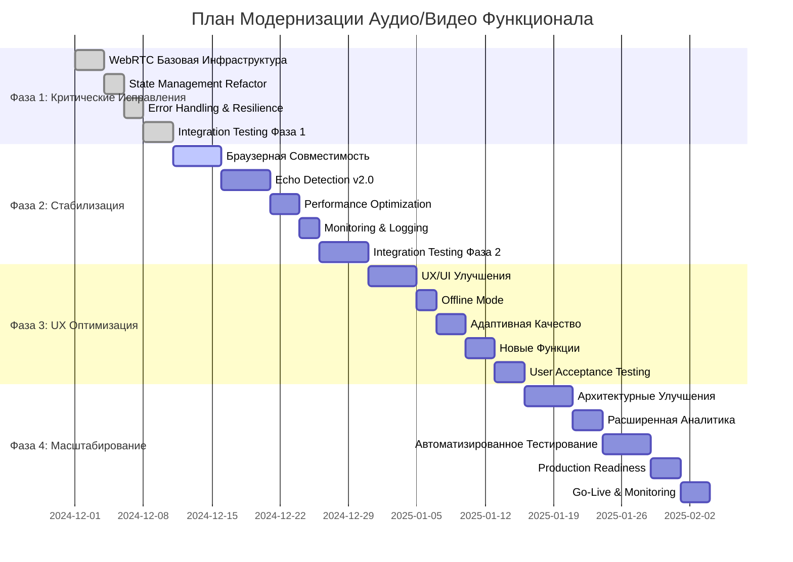

# 📅 Timeline Плана Модернизации

## 🗓️ Общий Timeline (14 недель)



## 📊 Детальный Breakdown по Неделям

### **Неделя 1-2: Фаза 1 (Критические Исправления)**

#### **Неделя 1**
```
Понедельник: WebRTC - Core Infrastructure Setup
Вторник: WebRTC - Signaling Server Implementation
Среда: WebRTC - UI Components & Integration
Четверг: State Machine - Design & Implementation
Пятница: State Machine - VoiceChat Integration & Testing
```

#### **Неделя 2**
```
Понедельник: Error Handling - Circuit Breaker Pattern
Вторник: Error Handling - Retry Logic & Fallbacks
Среда: Error Handling - User-Friendly Messages
Четверг: Integration Testing - End-to-End Scenarios
Пятница: Bug Fixes & Performance Optimization
```

### **Неделя 3-6: Фаза 2 (Стабилизация)**

#### **Неделя 3: Браузерная Совместимость**
```
Понедельник: Safari WebKit API Implementation
Вторник: Firefox mozSpeechRecognition Support
Четверг: Chrome/Edge Optimization
Пятница: Fallback to Whisper API
```

#### **Неделя 4: Echo Detection v2.0**
```
Понедельник: Enhanced TTS Profiling
Вторник: Frequency Analysis Implementation
Среда: ML-based Classification
Четверг: Adaptive VAD System
Пятница: Integration & Testing
```

#### **Неделя 5: Performance & Monitoring**
```
Понедельник: Memory Management Optimization
Вторник: CPU Usage Optimization
Среда: Performance Monitoring Setup
Четверг: Error Tracking (Sentry)
Пятница: Logging & Alerting
```

#### **Неделя 6: Integration Testing**
```
Понедельник: Cross-browser Testing
Вторник: Device Compatibility Testing
Среда: Network Resilience Testing
Четверг: Load Testing
Пятница: Bug Fixes & Documentation
```

### **Неделя 7-9: Фаза 3 (UX Оптимизация)**

#### **Неделя 7: UX/UI Улучшения**
```
Понедельник: VoiceChat UI Redesign
Вторник: Visual Feedback Enhancements
Среда: Accessibility (WCAG 2.1) Implementation
Четверг: Mobile Responsiveness
Пятница: User Testing & Iteration
```

#### **Неделя 8: Offline & Adaptive Features**
```
Понедельник: Service Worker Implementation
Вторник: Offline TTS Caching
Среда: Bandwidth Detection
Четверг: Progressive Enhancement
Пятница: Low-power Mode for Mobile
```

#### **Неделя 9: Новые Функции & Testing**
```
Понедельник: Voice Commands Implementation
Вторник: Multi-language Support
Среда: Conversation History
Четверг: User Acceptance Testing
Пятница: Final UX Polish & Bug Fixes
```

### **Неделя 10-14: Фаза 4 (Масштабирование)**

#### **Неделя 10: Архитектурные Улучшения**
```
Понедельник: Microservices Architecture Design
Вторник: API Versioning Implementation
Среда: Database Optimization
Четверг: Caching Layer (Redis)
Пятница: Code Modularization
```

#### **Неделя 11: Аналитика & Monitoring**
```
Понедельник: User Behavior Analytics Setup
Вторник: A/B Testing Framework
Среда: Performance Dashboards
Четверг: Conversion Funnel Analysis
Пятница: Real-time Monitoring
```

#### **Неделя 12: Автоматизированное Тестирование**
```
Понедельник: E2E Tests (Playwright)
Вторник: Performance Testing (Lighthouse)
Среда: Load Testing Setup
Четверг: Browser Automation
Пятница: CI/CD Pipeline Enhancement
```

#### **Неделя 13: Production Readiness**
```
Понедельник: Security Audit
Вторник: GDPR Compliance Check
Среда: Backup/Recovery Procedures
Четверг: Disaster Recovery Plan
Пятница: Documentation Updates
```

#### **Неделя 14: Go-Live & Post-Launch**
```
Понедельник: Production Deployment
Вторник: User Migration & Support
Среда: Performance Monitoring
Четверг: User Feedback Collection
Пятница: Retrospective & Next Steps
```

## 📈 Milestones & Checkpoints

### **Milestone 1: End of Week 2 (Фаза 1 Complete)**
- ✅ WebRTC basic calls working
- ✅ State management simplified
- ✅ Error handling robust
- ✅ Stability: >85%

### **Milestone 2: End of Week 6 (Фаза 2 Complete)**
- ✅ All browsers supported
- ✅ Echo detection >90% accuracy
- ✅ Performance optimized
- ✅ Full monitoring in place
- ✅ Stability: >90%

### **Milestone 3: End of Week 9 (Фаза 3 Complete)**
- ✅ UX significantly improved
- ✅ Offline mode functional
- ✅ New features stable
- ✅ User satisfaction >70 NPS
- ✅ Stability: >95%

### **Milestone 4: End of Week 14 (Go-Live Ready)**
- ✅ Architecture scalable
- ✅ Analytics comprehensive
- ✅ Testing automated
- ✅ Production secure & monitored
- ✅ Stability: >98%

## 🎯 Critical Path Items

### **Must-Have for Each Milestone**
```
Milestone 1: WebRTC MVP + State Management
Milestone 2: Cross-browser Support + Echo Detection
Milestone 3: UX Polish + Offline Mode
Milestone 4: Production Readiness + Analytics
```

### **Parallel Tracks**
- **Development**: Core functionality implementation
- **Testing**: Automated test suite development
- **UX**: User research & design iteration
- **DevOps**: Infrastructure & deployment preparation

## ⚠️ Risk Mitigation Timeline

### **High Risk Items**
- **WebRTC Complexity**: Week 1-2 (dedicated prototyping)
- **Browser Compatibility**: Week 3-4 (parallel testing)
- **Performance Issues**: Week 5-6 (optimization sprint)

### **Contingency Plans**
- **WebRTC Fails**: Fallback to text-only communication
- **Browser Issues**: Progressive enhancement with clear messaging
- **Performance Problems**: Feature flags for resource-intensive features

## 📊 Progress Tracking

### **Daily Metrics**
- Code commits & pull requests
- Test pass/fail rates
- Performance benchmarks
- User feedback scores

### **Weekly Reviews**
- Sprint retrospectives
- Milestone achievement checks
- Risk assessment updates
- Resource utilization review

### **Monthly Reports**
- Overall progress vs plan
- Budget vs actual spend
- Quality metrics trends
- Stakeholder updates

## 🚀 Acceleration Options

### **Option 1: Fast Track (10 недель)**
- Additional senior developers (+2)
- Parallel development streams
- Reduced scope for Phase 3 features
- **Risk**: Higher burnout, quality issues

### **Option 2: Standard Track (14 недель)**
- Current team size
- Sequential phase execution
- Full feature scope
- **Risk**: Slower time-to-market

### **Option 3: Phased Rollout (16 недель)**
- Beta release after Phase 2
- Gradual feature rollout
- User feedback integration
- **Risk**: Complex release management

---

*Timeline является гибким и может корректироваться на основе реального прогресса и обратной связи.*
